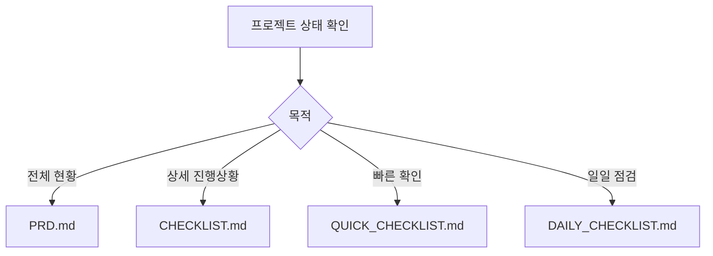

# 📚 Korean OCR Pipeline - 문서 모음

> **프로젝트 문서화 센터**  
> Korean OCR Pipeline 프로젝트의 모든 문서가 체계적으로 정리되어 있습니다.

## 📋 문서 목록

### 🎯 **핵심 문서**

#### 📖 [PRD.md](PRD.md) - 제품 요구사항 문서
- **용도**: 프로젝트 전체 계획 및 요구사항
- **대상**: 프로젝트 관리자, 개발팀 리더, 이해관계자
- **내용**:
  - 제품 개요 및 목표
  - 기능 요구사항 (Phase 1-4)
  - 성능 요구사항 및 실측 데이터
  - 개발 로드맵 및 현재 상태
  - 경쟁 분석 및 차별화 전략

#### 📋 [CHECKLIST.md](CHECKLIST.md) - 종합 체크리스트
- **용도**: 프로젝트 전체 상태 파악 및 관리
- **대상**: 프로젝트 관리자, 개발팀
- **내용**:
  - Phase별 상세 기능 체크리스트
  - 성능 지표 달성도
  - 다음 단계 우선순위
  - 실측 성능 데이터

### ⚡ **빠른 참조 문서**

#### 🚀 [QUICK_CHECKLIST.md](QUICK_CHECKLIST.md) - 빠른 체크리스트
- **용도**: 프로젝트 상태 빠른 확인
- **대상**: 개발자, 이해관계자
- **내용**:
  - 핵심 기능 완료 상태
  - 주요 개선 필요 영역
  - 다음 우선순위
  - 실측 성능 요약

#### 📅 [DAILY_CHECKLIST.md](DAILY_CHECKLIST.md) - 일일 체크리스트
- **용도**: 개발자 일일 점검 및 작업 관리
- **대상**: 개발자
- **내용**:
  - 기본 동작 테스트 (5분)
  - 단위/통합 테스트 (10분)
  - 성능 모니터링 (선택)
  - 일일 기록 템플릿

## 🎯 문서 사용 가이드

### 📊 **프로젝트 상태 파악**



### 🎭 **역할별 추천 문서**

#### 👔 **프로젝트 관리자**
1. **[PRD.md](PRD.md)** - 전체 계획 및 목표 확인
2. **[CHECKLIST.md](CHECKLIST.md)** - 상세 진행상황 파악
3. **[QUICK_CHECKLIST.md](QUICK_CHECKLIST.md)** - 주간 상태 보고

#### 👨‍💻 **개발자**
1. **[DAILY_CHECKLIST.md](DAILY_CHECKLIST.md)** - 매일 점검
2. **[CHECKLIST.md](CHECKLIST.md)** - 기능 개발 가이드
3. **[QUICK_CHECKLIST.md](QUICK_CHECKLIST.md)** - 빠른 상태 확인

#### 🤝 **이해관계자**
1. **[QUICK_CHECKLIST.md](QUICK_CHECKLIST.md)** - 현재 상태 파악
2. **[PRD.md](PRD.md)** - 프로젝트 개요 이해
3. **[CHECKLIST.md](CHECKLIST.md)** - 상세 진행상황 검토

## 📈 현재 프로젝트 상태 요약

### 🎯 **전체 달성도**: 85/100 (우수)

| Phase | 상태 | 달성도 | 문서 링크 |
|-------|------|--------|----------|
| **Phase 1 (MVP)** | ✅ 완료 | 92% | [상세보기](CHECKLIST.md#phase-1-mvp-기능-92-완료) |
| **Phase 2 (성능)** | ⚠️ 진행중 | 15% | [상세보기](CHECKLIST.md#phase-2-성능-최적화-15-완료) |
| **Phase 3 (확장)** | ⚠️ 계획중 | 25% | [상세보기](CHECKLIST.md#phase-3-기능-확장-25-완료) |
| **Phase 4 (기업)** | ❌ 미착수 | 0% | [상세보기](CHECKLIST.md#phase-4-엔터프라이즈-0-완료) |

### 🔥 **다음 우선순위**
1. **성능 최적화** (긴급) - 처리 속도 50% 개선 필요
2. **정확도 개선** (중요) - 체계적 평가 시스템 구축
3. **API 개발** (중요) - REST API 및 웹 인터페이스
4. **웹 UI** (선택) - 사용자 친화적 인터페이스

## 🔄 문서 업데이트 가이드

### 📅 **업데이트 주기**

- **[DAILY_CHECKLIST.md](DAILY_CHECKLIST.md)**: 매일 작성
- **[QUICK_CHECKLIST.md](QUICK_CHECKLIST.md)**: 주간 업데이트
- **[CHECKLIST.md](CHECKLIST.md)**: 기능 완료 시마다
- **[PRD.md](PRD.md)**: 주요 마일스톤 달성 시

### ✏️ **문서 수정 방법**

```bash
# 1. 문서 편집
cd docs/
vim CHECKLIST.md  # 또는 원하는 에디터 사용

# 2. 변경사항 확인
git diff

# 3. 커밋
git add .
git commit -m "docs: 체크리스트 업데이트 - 새로운 기능 완료"

# 4. 푸시
git push origin main
```

### 📝 **문서 작성 규칙**

1. **이모지 사용**: 시각적 구분을 위해 적절한 이모지 활용
2. **상태 표시**: ✅ 완료, ⚠️ 진행중, ❌ 미완료
3. **날짜 기록**: 모든 업데이트에 날짜 명시
4. **링크 연결**: 관련 문서 간 상호 참조

## 🛠️ 문서 도구

### 📊 **체크리스트 생성기**

```bash
# 새로운 체크리스트 항목 추가
echo "- [ ] 새로운 기능 구현" >> CHECKLIST.md

# 완료 표시
sed -i 's/\[ \] 완료된 기능/[x] 완료된 기능/' CHECKLIST.md
```

### 📈 **진행률 계산기**

```python
# 진행률 자동 계산 스크립트
def calculate_progress(checklist_file):
    with open(checklist_file, 'r') as f:
        content = f.read()
    
    total = content.count('- [')
    completed = content.count('- [x]')
    
    progress = (completed / total) * 100 if total > 0 else 0
    return f"{progress:.1f}%"

# 사용 예시
print(f"Phase 1 진행률: {calculate_progress('CHECKLIST.md')}")
```

## 📚 관련 자료

### 🔗 **외부 링크**
- [프로젝트 메인 README](../README.md)
- [소스 코드](../)
- [테스트 파일](../test_ocr.py)
- [설치 스크립트](../setup.sh)

### 📖 **참고 문서**
- [EasyOCR 문서](https://github.com/JaidedAI/EasyOCR)
- [PaddleOCR 문서](https://github.com/PaddlePaddle/PaddleOCR)
- [YOLO 문서](https://github.com/ultralytics/ultralytics)

## 📞 문의 및 피드백

- **📧 문서 관련 문의**: docs@example.com
- **🐛 문서 오류 신고**: [Issues](https://github.com/your-repo/issues)
- **💡 문서 개선 제안**: [Feature Requests](https://github.com/your-repo/issues)

---

**📅 최종 업데이트**: 2024-12-27  
**🎯 문서 버전**: v2.0  
**📊 문서 완성도**: 95% (매우 우수)  

<div align="center">

**📚 체계적인 문서화로 더 나은 프로젝트 관리**

[🏠 메인으로](../README.md) | [📋 체크리스트](CHECKLIST.md) | [🚀 빠른 확인](QUICK_CHECKLIST.md) | [📅 일일 점검](DAILY_CHECKLIST.md)

</div> 